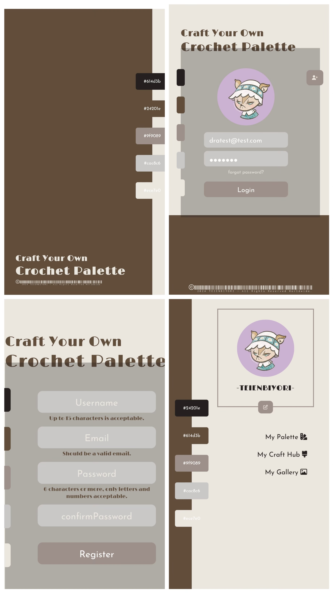
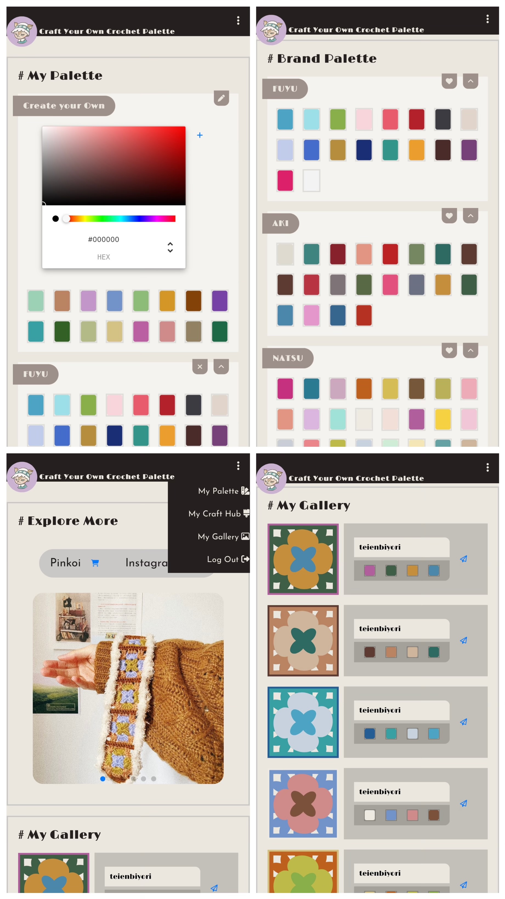
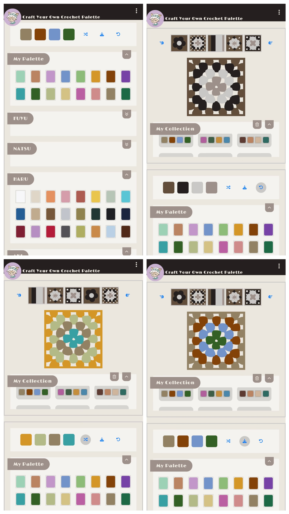
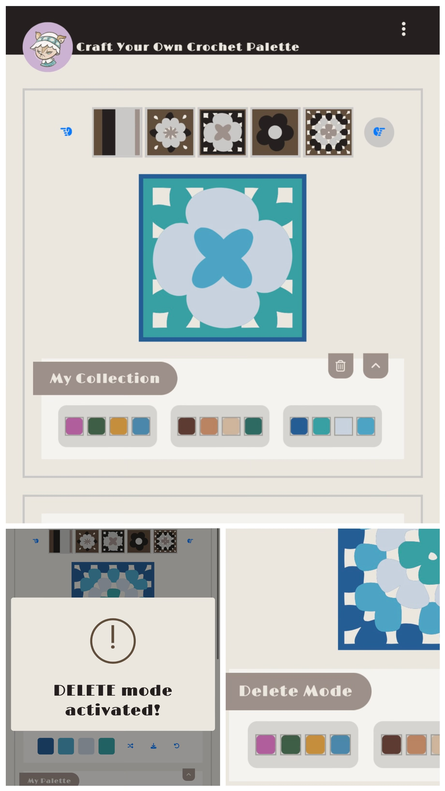

# Craft Your Own Crochet Palette 
##### 為鉤針編織創作者設計的織片配色網站
##### かぎ針編みクリエーター向けのカラーコンビネーションウェブサイト

<div>


</div>

##### [Take a 30-second peek at Instagram Reels](https://www.instagram.com/reel/C6hBS7hPK5p/)

This webpage is tailored for crochet enthusiasts to store their personalized color palettes.<br> 
Users can apply these palettes directly to crochet patterns, offering a clearer visualization of how selected color combinations will appear on their products.<br>
By automating color blending and providing inspiration for combinations, this tool saves creators time and sparks new ideas for stunning color schemes.<br>
此網站功能包含：自選色、填色織片、隨機調換配色、儲存配色、配色織片展示。<br>
透過以上功能，可以立即且直觀地呈現織片的實際配色。<br>
你再也不用靠想像、手繪，或者實際把織片鉤出來才知道配色滿不滿意，輕鬆按幾個按鈕便能做到！<br>

### Features
1. **Users can create their own crochet palettes:**
   - Add colors using a color picker.
   - Choose colors from a selection of provided brands/stores color collections.
2. **Users can apply chosen colors to crochet patterns:**
   - Randomly shuffle the applied color combinations on the pattern.
   - Manually change the color combinations on the pattern.
3. **Users can save their personal color combinations.**
4. **Users can view all patterns showcasing each color combination.**<br>

### Pages Overview
Welcome to "Craft Your Own Crochet Palette". Below are the main pages of the website and their functions:
1. **User Page**
   - The landing page after logging in.
2. **My Palette**
   - (according to Feature 1)
3. **My Craft Hub**
   - (according to Feature 2 & 3)
4. **My Gallery**
   - (according to Feature 4)<br>

<div>


</div>

### Getting Started
To get started with this project, follow these steps:
_We recommend using Node.js version 20.10.0 or later for compatibility with the project dependencies._
1. **Clone the Repository**
Open your terminal.
Navigate to the directory where you want to clone the project.
Run the following command to clone the repository:
```
git clone https://github.com/teienbiyori/Your-Own-Crochet-Palette.git
```
2. **Install project dependencies using npm:**
```
npm install
```
3. **Run Project**
```
npm run dev
```

### Dependnecies
- axios: "^1.6.8"
- clsx: "^2.1.0"
- react: "^18.2.0"
- react-color: "^2.19.3"
- react-dom: "^18.2.0"
- react-input-color: "^4.0.1"
- react-router-dom: "^6.22.3"
- sass: "^1.75.0"
- styled-components: "^6.1.8"
- sweetalert2: "^11.10.7"<br>

### Roadmap
Our roadmap includes the following upcoming features:
1. **Yarn Supplier Palette Form**
   - Implement a form page that allows yarn suppliers to showcase their color palettes by adding the specific colors they offer. This feature will enable suppliers to reach more crocheters and knitters by showcasing the range of yarn colors available. 
2. **Palette Reordering** (Feature updated and completed as of April 2024)
   - Implement a functional button to reorder colors in the palette based on ascending hexcode values. This upcoming feature will simplify navigation and help users quickly locate specific colors within the palette. It enhances usability and aesthetics by organizing colors in a more structured and visually appealing manner.
3. **Display Brand Name on Color Hover**
   - Improve the user experience by displaying the brand name of each color when the mouse hovers over it in the palette. Knowing the brand name will enable users to easily locate and purchase the specific yarn needed to bring their project designs to life.


### Contributors
##### Back-End - [@Tommy0901](https://github.com/Tommy0901)
##### Front-End & UI/UX - **teienbiyori Dra**

